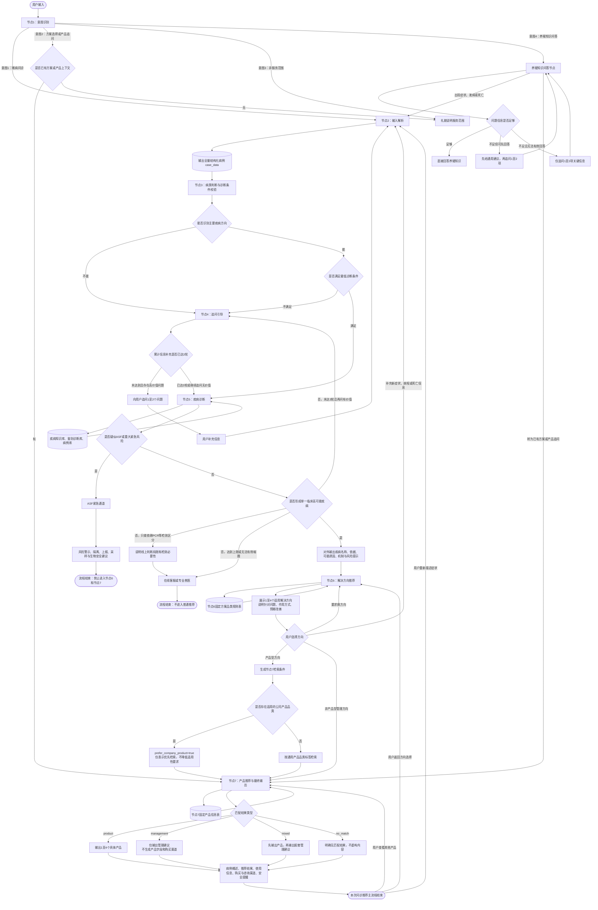
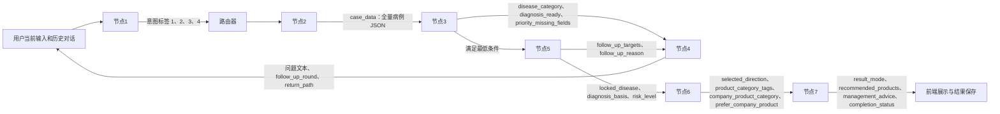

# 牧客智语 Coze 工作流流程图

> 用途：供 AI 和工作流搭建人员理解节点职责、路由条件、循环关系及数据传递。
>
> 规则优先级：节点正文与当前 Prompt > 评测说明。当前节点正文规定最多进行 3 轮信息补充，不设置第 4 轮。

## 一、主工作流

## 二、节点间核心数据流

## 三、Coze 条件节点建议

| 条件节点 | 建议判断字段 | 分支 |
|-|-|-|
| 意图路由 | `intent_code` | `1→节点2`；`2→节点7`；`3→非服务范围`；`4→养殖知识问答` |
| 诊断条件 | `diagnosis_ready` | `false→节点4`；`true→节点5` |
| 追问上限 | `follow_up_round`、`has_high_value_question` | `<3 且 true→继续追问`；否则返回节点5收口 |
| 紧急风险 | `emergency_type`、`risk_level` | `ASF/重大风险→紧急通道`；否则继续诊断 |
| 疾病锁定 | `is_locked`、`need_professional_testing`、`need_customer_service` | 锁定→节点6；需检测/客服→终止普通推荐；可继续鉴别→节点4 |
| 方向类型 | `direction_type` | `product→节点7产品检索`；`non_product→节点7管理建议输出` |
| 公司产品 | `prefer_company_product` | `true→适用公司产品优先`；`false→普通产品排序` |
| 最终结果 | `result_mode` | `product`、`management`、`mixed`、`no_match` |

## 四、搭建时必须保持的约束

1. 节点2每轮输出的是全量病例，不是仅输出本轮新增字段。
2. 节点3只判断病类和最低诊断条件，不输出具体疾病。
3. 节点4不自行决定医学追问方向，只把节点3或节点5给出的目标转成用户能回答的问题。
4. 每轮追问约1至2项；已确认、用户无法提供或已问过的信息不得重复追问。
5. 最多进行3轮信息补充；达到上限后不得再次进入节点4。
6. 节点5的内部候选疾病不直接展示给用户；只有形成单一临床高可能疾病后，才进入节点6。
7. 仅凭临床信息无法区分且必须依赖检测时，不强行锁定疾病，也不进入节点6。
8. ASF或重大紧急风险一旦触发，立即中止节点6、节点7的普通推荐流程。
9. 节点6只从固定方案品类规则表读取方向，不自由生成方向。
10. 公司产品只能在医学适用程度相近时优先，不得覆盖疾病处理顺序或强行推荐。
11. 节点7的产品和管理建议只能来自固定产品信息表；缺失信息不得推测。
12. 管理建议类结果不套用产品字段；混合结果必须先产品、后管理建议。

## 五、PRD 内部待统一项

当前节点4、节点5正文规定“最多三轮信息补充，不设置第四轮”；评测说明中仍存在“第四轮保底”的旧表述。Coze 工作流建议暂按正文执行：第3轮信息补充完成后，由节点5直接形成临床结果、进入检测/客服，不再发起第4轮。
